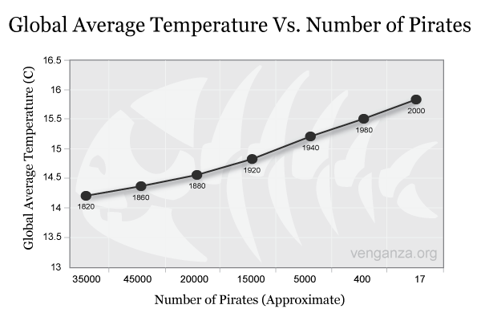

# Exploring the R tutorial data

This *R Markdown* document is a straightforward conversion of the R tutorial script to a document that can be rendered as HTML, PDF or Word in RStudio.

Note that the document starts with a so-called "preamble" that gives RStudio some metadata about the document itself. You can learn way more about this on the [RStudio Rmarkdown website](http://rmarkdown.rstudio.com).

```{r setup, include=FALSE}
# This "chunk" isn't displayed (because include=FALSE) but does important setup work.
knitr::opts_chunk$set(echo = TRUE)
library(rms)
library(ggplot2)
library(car)
library(dplyr)
library(stargazer)

# data from day 1
alldata <- read.csv("alldata.csv")
```

## RESEARCH QUESTION 3: cog1 ~ dx (t-test)

Lets first consider a t-test comparing `cog1` and `dx`. 

```{r, echo=F}
my.t.result <- t.test(data=alldata, cog1 ~ dx) 

my.t.results.txt = paste0('t(',
                        round(my.t.result$parameter,1),
                        ') = ',
                        round(my.t.result$statistic,2), ', p = ',
                        round(my.t.result$p.value, 7))

data.toplot <-filter(alldata, !is.na(cog1), !is.na(dx))

# Note that simply calling ggplot here is enough to make the plot appear in your document
ggplot(data.toplot, aes(y=cog1,x=dx)) + 
  geom_boxplot(outlier.shape=NA) + 
  geom_jitter(alpha=0.5) +
  labs(title="Effect of Diagnosis on Cog Score #1",
       y = "Cognitive Test 1",
       x = "Diagnosis") +
  annotate("text", label = my.t.results.txt, x = 1, y = 21) +
  theme_bw()
```

Another important features is being able to reference R objects inline with other text.  For instance, here are some aspects of the t-test we performed. The t statistic is `r my.t.result$statistic`, and the degrees of freedom is `r my.t.result$parameter`, with the p-value being `r signif(my.t.result$p.value, 2)`.

We can also show off statistical tables by setting the `results='asis'` option on the R chunk; this is because of how stargazer works.

```{r results='asis'}
my.stats.table <- alldata %>% 
                  group_by(dx) %>%
                  summarise("Mean" = mean(cog1, na.rm = T),
                            "St Dev" = sd(cog1, na.rm = T))

stargazer(my.stats.table, summary=F, rownames = F, type="html")
```

# RESEARCH AIM 4: score ~ age (linear regression)
Here is some info on the linear model `score ~ age` compared to `score ~ age + sex`:

```{r results='asis', echo=F}
# this is the base package way
alldata$totalcog1 <- (alldata$cog1 + alldata$cog3)/alldata$cog2

# using dplyr's mutate verb
alldata <- mutate(alldata, 
                  totalcog = cog1 + cog3 / cog2)

# simple linear regression (two ways: base package and rms)
lm.base <- lm(data=alldata, totalcog ~ age)
lm.base.w.sex <- ols(data=alldata, totalcog ~ age + sex)

# compare outputs
stargazer(lm.base, lm.base.w.sex, type="html")
```

# Another important relationship

